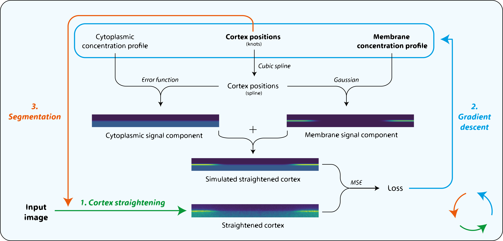

# Package name

Performs dual segmentation and membrane-signal quantification on images of cells by fitting images to a differentiable model

## Introduction

Address the problem here. We have images of cells and want to quantify membrane signal

Can draw a sketch: image -> rough idea of what membrane profile should look like

Requires a two step process:
- Segmentation to find the cell edge (sketch)
- Fitting cross sectional profiles to a model (sketch)

Here I show that these steps can be combined in an end-to-end fashion to perform segmentation and quantification simulataneously

Advantages:
- less user workload
- more accurate

## Differentiable model

Schematic of model

Based on a model found in Gross et al

More figures/animations showing the model in action

## Applications

Some examples from the papers it's been used in

Could try it on some images of cells from other systems e.g. yeast?

## Publications

List of publications that used this code: KB micropub, Rukshala's paper, Filopodia paper?, 
(Nelio's paper, KB P1 paper, my paper)

(Some of these use an older variant of the code)

